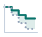

<p align="center">
  <picture>
    <source media="(prefers-color-scheme: dark)" srcset="assets/logo-dark.svg">
    
  </picture>
</p>

<h1 align="center">sublift</h1>

<p align="center">
  <b>Measure what a retention experiment was actually worth.</b><br>
  A Python library for the incremental lifetime value of subscription A/B tests —
  censored outcomes, competing risks, and inference that survives being watched.
</p>

<p align="center">
  <a href="https://github.com/devjoinedthechat/sublift/actions/workflows/ci.yml"></a>
  
  
  
  
  
</p>

<p align="center">
  <a href="#install">Install</a> ·
  <a href="#quickstart">Quickstart</a> ·
  <a href="#what-it-does">What it does</a> ·
  <a href="#how-it-compares">Compare</a> ·
  <a href="#evidence">Evidence</a> ·
  <a href="#scale">Scale</a> ·
  <a href="#api">API</a> ·
  <a href="docs/">Docs</a>
</p>

---

You ran a save offer against a holdout. Retention went up. Was it worth it?

```python
import sublift as sl

print(sl.incremental_ltv(panel, horizon=12, strata=["plan", "tenure_bucket"]))
```

```
Incremental LTV over 12 billing periods
=======================================
  -12.1845 revenue per subscriber
  95% CI [-13.2493, -11.1197]   se 0.5433   p = 0.0000
  relative to control: -14.09% [-15.23%, -12.95%]

  control      n=  20,140   value      86.4767
  treatment    n=  19,860   value      74.2922

  estimator: stratified   inference: influence
  strata: plan, tenure_bucket

  if you have been monitoring this test, read this line instead:
  anytime-valid 95% CS at n=40,000: [-13.8343, -10.5347] (excludes 0); 1.55x the fixed-sample width
```

The offer bought **+0.32 billing periods** per subscriber and **destroyed $12.18 of lifetime
value**: the discount that held those subscribers cost more than holding them was worth. A
30-day retention test calls that a win.

## Why this is hard

Four problems at once, and the usual answer — a two-proportion z-test on 30-day retention —
solves none of them.

**The outcome is censored.** Most subscribers in your test are still active. Their lifetime value
hasn't happened yet. Averaging realised revenue is biased downward, and biased *differently in
each arm* whenever the treatment moved the churn curve — which is the entire thing you are
trying to measure.

**Churn is discrete.** Subscriptions don't decay continuously; they end at renewal. The hazard is
a spike train on billing boundaries, with a cliff at the annual anniversary. Continuous-time
machinery smooths over exactly the structure that matters.

**The effect is slow and the base is noisy.** A 1.5-point retention lift on a 6% monthly churn
base needs either enormous samples or real variance reduction. So teams substitute a 30-day
proxy, which is a different question with a more convenient answer.

**Everybody peeks.** A fixed-sample 95% interval is only a 95% interval if you look once. Under
daily monitoring its false-positive rate climbs far past 5%, because a random walk eventually
crosses any fixed boundary. Measured [below](#evidence): **26.4%** across sixteen looks.

## Install

```bash
pip install sublift
```

Python 3.10+. Depends on numpy, scipy and pandas — nothing else.

## Quickstart

One call runs the checks in the order that matters, then the estimate, then says what to make of
both:

```python
import sublift as sl

panel = sl.SubscriberPanel.from_spans(
    df,
    subject="user_id",
    arm="variant",
    assigned_at="experiment_entered_at",   # start of period 1, not signup date
    ended_at="subscription_ended_at",      # null = still active
    observed_through="2026-09-01",         # the data cut
    billing_interval="month",
    price="mrr",
    cause="churn_reason",                  # optional: voluntary vs involuntary
    cluster="account_id",                  # optional: if you randomised by account
    covariates=["plan", "tenure_bucket", "engagement"],
)

print(sl.review(panel, horizon=12, strata=["plan"], monitoring=True))
```

```
Experiment review
=================

  VERDICT: usable, with the caveats below.

  [warning] Fragile to censoring: the estimate flips at gamma = 0.90
      Censored subscribers would only have to stay 10% less long than
      otherwise-identical subscribers who were not censored — for a reason no column
      records — for this effect to change sign. Treat the direction as the finding
      and the magnitude as soft.

  [note] Retention went up and lifetime value went down
      ...
```

A **blocker** — a sample ratio mismatch, say — means the number below it is not measuring what it
says, and the verdict reads *do not act on this*. The estimate is still computed, because hiding
it only invites someone to compute it a worse way somewhere with fewer checks. A **warning** is a
caveat that changes how far a result should be pushed. A **note** is a finding in its own right.

Everything `review` calls is available separately, and it introduces no statistics of its own.
It is the estimators in the order an experienced analyst would run them.

## What it does

### One estimand, stated explicitly

Fix a horizon `H` of billing periods. With `T` periods paid and `S(t) = P(T > t)`:

```
LTV(H)  =  Σ_{t=1..H}  w_t · S(t-1)
```

`w_t` is period-`t` revenue — a known price schedule, or revenue observed in the panel. With
`w_t = 1` it collapses to restricted mean survival time: expected billing periods retained. One
primitive, both readouts, and the contrast between arms is the answer.

**The horizon is mandatory.** A "lifetime" value with no horizon is an extrapolation wearing a
measurement's clothes. sublift makes you name it and refuses to estimate past your data unless you
pass `allow_extrapolation=True` and label the number a projection.

### Three estimators, one estimand

| | assumes | inference | monitor sequentially? | good below ~5k? |
|---|---|---|---|---|
| `unadjusted` | randomisation, independent censoring | influence function | ✅ | ✅ |
| **`stratified`** (default) | + strata are pre-assignment | influence function | ✅ | ✅ |
| `adjusted` | + a hazard model in the covariates | efficient influence function | ✅ | ❌ |

`stratified` is the default because it reduces variance, stays valid under monitoring, and its
influence function is exact at any sample size. `adjusted` is a one-step (AIPW) estimator: it gets
the most from continuous covariates and is doubly robust, at the cost of a first-order variance
whose coverage is a large-sample promise. It warns below 5,000 subscribers rather than quietly
running narrow. See [choosing an estimator](docs/choosing-an-estimator.md).

### And the questions that follow

Each has a page in [docs/](docs/) explaining the method. Here is what it is for, and the number
that makes the case.

**[Monitoring a running test](docs/monitoring.md)** — `result.confidence_sequence()`. A
fixed-sample interval is only a 95% interval if you look once; checked at sixteen interim points
its false-positive rate is **26.4%**. A confidence sequence is valid at every sample size
simultaneously, so you may stop whenever you like, including because of what you just saw. All
three estimators support it — which is why the influence functions are derived by hand rather
than bootstrapped.

**[Several arms, one error rate](docs/multi-arm.md)** — `multi_arm_lift`. Testing three save
offers and reporting the best is one experiment with three chances to be wrong: with four null
arms, declaring a winner happens **13.0%** of the time uncorrected. The default correction is
max-t, which beats Bonferroni because contrasts sharing a control arm correlate at 0.5.
`comparisons="all-pairs"` when the arms are alternatives rather than variations on a holdout.

**[Slicing the base](docs/segments.md)** — `segment_scan`. "It worked great for annual subscribers
on iOS" is the most common false finding. Slice a **null** experiment eight ways and
per-comparison tests report a segment that differs **26.4%** of the time; this reports one 5.2%
of the time. It also catches the trap that a *uniform* odds ratio produces genuinely different
retained periods per segment, and labels that a scale artefact rather than a mechanism.

**[Subscribers who come back](docs/win-backs.md)** — `from_spells`, `occupancy_lift`. People
cancel and resubscribe, or pause over the summer. Time-to-first-cancellation cannot see any of it,
and the error runs the wrong way: the subscribers written off as lost are disproportionately in
the *control* arm, so at a 20% win-back rate it overstates the win by **44%**.

**[Voluntary vs involuntary churn](docs/competing-risks.md)** — `churn_decomposition`. A fifth to
two fifths of subscription churn is a failed card, not a decision, and a save offer cannot act on
it. The split is an exact identity, not an attribution, so causes sum to the headline with no
residual — against a stratified headline too, if you pass the same `strata=` — and it surfaces effects a single hazard cannot express, such as retention *increasing*
exposure to payment failure.

**[Pre-period variance reduction](docs/getting-started.md)** — `cuped`. The strongest variance
reducer available is rarely a cleverer estimator; it is the subscriber's own behaviour before
randomisation. The usual CUPED derivation is for a difference in means, and this estimand is not
one — but any estimator that exposes an influence function is a mean of it, and a covariate's
imbalance between arms is another, so projecting the first onto the second works for survival,
occupancy, competing risks or a segment alike. Pre-period tenure alone removes **11%** of the
variance in simulation, and it never touches the outcome model.

**Triggered interventions** — `complier_effect`. A save offer fires when someone opens the cancel
flow, so most of the base never meets it. Intention to treat — what every estimator here reports —
is the effect of *being assigned*, which is what a launch decision wants. The complier effect is
what the offer does to someone who sees it, which is what a design decision wants. At a 25%
trigger rate they differ by a factor of four, and quoting the second as the first overstates the
programme by exactly the reciprocal of the exposure rate.

**Flexible nuisance models** — `learner=`. `adjusted` fits a logistic hazard by default. Pass any
classifier with `fit` and `predict_proba` and it is **cross-fitted automatically**: a flexible
model fitted on the same rows the estimate is read from carries a bias of the same order as the
effect, and the augmentation does not remove it. Cross-fitting is the difference between double
machine learning and using machine learning.

**Clustered randomisation** — `cluster=`. When accounts are randomised but subscriptions are
analysed, subscriptions within an account are not independent, and intervals computed as if they
were come out too narrow with no warning. Pass the unit you actually randomised and every interval
— contrasts, segments, arms, and the confidence sequences — treats clusters as the independent
units.

**Diagnostics that run whether you ask or not** — `check_randomization` tests sample ratio
mismatch on every estimate, because broken assignment invalidates everything downstream and fails
silently. `check_censoring` tests whether censoring is really administrative, and
[`censoring_sensitivity`](docs/assumptions.md#2-censoring-is-administrative) bounds the part no
test can reach: how far independent censoring would have to fail before the conclusion changes.

**Families you assemble yourself** — `correct_family`. `multi_arm_lift` knows about arms and
`segment_scan` about segments, but only you know what you actually looked at. Three arms over four
segments is twelve comparisons, not three plus four. This is also where max-t earns most: with a
flat price, LTV and retained periods correlate at **1.00** — the same statistic scaled — and it
prices them as the one comparison they are.

**Planning and targeting** — `duration_to_detect` answers how long until the test can answer the
question, by simulating your actual enrollment schedule. `qini` gives cross-fitted per-subscriber
effects, with a pooled shrunk-interaction learner that beats a T-learner whether or not effect
modification is real (0.26 → 0.62 when it isn't, 0.94 → 0.97 when it is).

## How it compares

| | has | missing |
|---|---|---|
| `lifelines`, `scikit-survival` | survival, RMST | no causal contrast, no experiment readout |
| `EconML`, `DoWhy`, `CausalPy` | causal contrasts | no censoring, no subscription semantics |
| `lifetimes`, `PyMC-Marketing` | LTV | built for *non-contractual* retail; wrong model class |
| Eppo, Statsig, Optimizely | sequential testing | closed source, generic metrics, no censored-LTV estimand |
| a t-test on 30-day retention | simplicity | answers a different question |

sublift is the intersection: **contractual discrete-time survival, a causal contrast, censored
LTV, and anytime-valid inference**, in one estimand.

## Evidence

A library that reports confidence intervals is worth nothing if the intervals don't cover, and you
cannot check coverage against real data, because real data doesn't come with a true effect
attached. So the ground-truth simulator is part of the public API, and the test suite is built on
it. Everything below is reproducible:

```bash
python examples/validation_report.py     # prints this section
pytest -m slow                           # asserts it
```

**The intervals are real.** 400 replications, 4,000 subscribers each, nominal 95%:

| estimator | coverage | bias | reported se | actual spread |
|---|---|---|---|---|
| `unadjusted` | 94.8% | +0.00007 | 0.0919 | 0.0929 |
| `stratified` | 93.8% | −0.00097 | 0.0910 | 0.0927 |
| `adjusted` (n=16k) | 94.5% | −0.00018 | — | se/sd = 1.009 |

**Every influence function is checked against something that shares no derivation with it.** The
influence functions are the riskiest surface here: each is a hand derivation, every interval is
built from them, and an error would produce confident, plausible, wrong intervals rather than a
crash. Checking against the bootstrap is weak evidence, since both are the same author's work. So
each is also checked against leave-one-out, which needs nothing but the ability to re-run the
estimator on `n-1` subscribers:

```
IF_i  ≈  (n-1) · (θ_full − θ_without_i)
```

All thirteen agree. The ones that should be exact — product-limit, the revenue term, the
stratum-share term, both competing-risks causes, occupancy, segments, arms, the delta-method
ratio — sit at correlation 1.0000 with slopes within 0.5% of one. The two first-order ones sit at
0.998 and 0.999, which is what a first-order approximation should do.

**The validation is not circular.** The simulator encodes one author's assumptions about how
subscriptions behave, and if those were the assumptions baked into the estimators, none of this
would prove anything. So one test generates from somewhere else entirely: continuous-time Weibull
lifetimes discretised onto billing periods, gamma frailty so hazards are *not* logistic in
anything observed, and a treatment that acts by accelerating time rather than shifting odds. All
three estimators recover the true effect within 1.5 standard errors, including the
covariate-adjusted one with a now badly misspecified model.

**Censoring is handled where the obvious alternative fails.** "Naive" differences mean observed
tenure — treating still-active subscribers as though they ended on the day you pulled the data.
True effect: +0.2587 periods.

| follow-up | censored | sublift bias | naive bias |
|---|---|---|---|
| 9 periods | 65% | +0.021 | **−0.121** |
| 12 periods | 59% | +0.018 | −0.085 |
| 18 periods | 51% | −0.014 | −0.074 |

**Peeking really is that bad, and the sequence really does fix it.** A true null, monitored at 16
interim looks, 250 replications:

| | false positives |
|---|---|
| fixed-sample 95% interval, checked at every look | **26.4%** |
| anytime-valid 95% confidence sequence | **0.8%** |

Nominal rate: 5%. Sixteen looks turn a 5% test into a 26% one.

## Scale

One million subscribers, twelve billing periods, on a laptop:

| call | time | peak memory |
|---|---|---|
| `retained_periods_lift` (unadjusted) | 0.30s | 76 MB |
| `retained_periods_lift` (stratified) | 1.54s | 138 MB |
| `incremental_ltv` | 0.41s | 168 MB |
| `churn_decomposition` | 0.18s | 97 MB |
| `segment_scan` (8 segments) | 0.22s | 53 MB |
| `retained_periods_lift` (adjusted) | 1.89s | 803 MB |
| **`review`** (checks + both metrics + causes) | **1.89s** | **160 MB** |

At **ten million** subscribers everything is still under twenty seconds: `retained_periods_lift`
3.3s/0.5 GB, `segment_scan` 6.7s/0.8 GB, `review` 11.4s/0.7 GB. The algorithms are linear in
subscribers, so a hundred million extrapolates to roughly half a minute and 5–8 GB — a server,
not a laptop.

Two properties are worth knowing because they are not the obvious ones. **Memory does not grow
with the horizon**: the influence function forms no subscriber-by-period array at all, because
both of its terms collapse to lookups into arrays of length `horizon`. And **`segment_scan` memory
does not grow with the number of segments**, only with the number of dimensions scanned —
cross-producting three dimensions into 18 segments costs less than scanning them as 8.

`tests/test_scale.py` asserts these budgets, because reintroducing an `(n, horizon)` temporary in
a hot path is easy and no correctness test would catch it.

## API

| | |
|---|---|
| **`review`** | **the checks, the estimate and a verdict — start here** |
| `SubscriberPanel.from_spans` | dates in, billing periods out |
| `.from_spells` | several paying spells per subscriber (win-backs, pauses) |
| `.from_periods` / `.from_subjects` | already have period counts |
| `check_randomization` | SRM + baseline balance |
| `check_censoring` | is censoring really administrative? |
| `censoring_sensitivity` | how wrong that would have to be to change the answer |
| `incremental_ltv` | the money question |
| `retained_periods_lift` | the retention question |
| `occupancy_lift` | periods paid for, when subscribers return |
| `occupancy_decomposition` | those periods split by why they lapsed |
| `churn_decomposition` | voluntary vs involuntary |
| `multi_arm_lift` | many arms vs one control, family-wise error control |
| `segment_scan` | effects by segment, without manufacturing findings |
| `correct_family` | correct across any family you assembled yourself |
| `cuped` | variance reduction from pre-period behaviour |
| `complier_effect` | effect among the exposed, for triggered interventions |
| `SubscriberPanel.contrast` | pull one comparison out of a multi-arm panel |
| `LiftResult.confidence_sequence` | anytime-valid interval |
| `LiftResult.relative_ci` | interval for the % lift (delta method, not `ci / control`) |
| `LiftResult.curves` | per-arm survival and cumulative value |
| `duration_to_detect` | how long until this test can answer |
| `qini` / `uplift_scores` | targeting |
| `simulate_experiment` / `simulate_multi_arm` | ground-truth data for planning and validation |

Twenty functions, of which a first analysis needs about seven. The rest of the public namespace is
the result types those functions hand back — `LiftResult`, `SegmentScan`, `ExperimentReview` —
exported so they can be annotated and inspected, not because anything needs to construct them.

Results render as HTML in Jupyter, and `SubliftError` / `PanelError` / `NotIdentifiedError`
separate "your data is malformed" from "the data cannot answer that question". Both still subclass
`ValueError`, so existing handlers keep working.

## Assumptions

Stated rather than buried:

- **Assignment is randomised.** No observational identification.
- **Censoring is administrative** — you cut the data on a date. Dropout that depends on
  subscriber state violates this; `check_censoring` tests it and `censoring_sensitivity` bounds
  it.
- **Covariates are measured before assignment.** Adjusting for anything measured afterwards
  reintroduces the bias randomisation removed. `from_periods` and `from_spells` see several rows
  per subscriber and reject a covariate that changes within one; `from_spans` and `from_subjects`
  see one row each and **cannot tell**, so there the rule is yours to keep. The balance check in
  `check_randomization` is a partial backstop — a covariate that is genuinely post-assignment
  usually shows up imbalanced — but it cannot distinguish that from chance.
  `complier_effect` is the deliberate exception: its exposure column *must* be post-assignment,
  which is why it is passed to that function explicitly rather than inferred.
- **Subscribers are independent** unless you pass `cluster=`.
- **Assignment equals exposure** unless you pass an exposure column to `complier_effect`, which
  then rests on an exclusion restriction: assignment changes nothing for a subscriber who never
  triggers.
- **Two arms** for the ordinary estimators; use `multi_arm_lift` for more.
- **`occupancy_lift` needs potential follow-up recorded**, and refuses without it, because
  otherwise "not paying in period nine" and "nobody observed period nine" are the same row.
  `from_spells` and `from_spans` record it.
- **`estimator="adjusted"` is asymptotic.** Its influence function is first-order, so coverage is
  a large-sample promise: about 93% at 4,000 subscribers against a nominal 95%, nominal by around
  16,000. It warns below 5,000. The other two estimators are exact at any size.
- **`cuped` needs genuinely pre-period covariates.** Adjustment with a post-assignment covariate
  biases the estimate; CUPED with one *moves* it, because the imbalance it subtracts no longer
  has expectation zero.

### What is not here

- **Covariate-adjusted competing risks.** `churn_decomposition` takes `strata=` and reconciles
  exactly with a stratified headline, but there is no covariate-adjusted version.
- **A default beyond the logistic hazard.** Any cross-fitted classifier can be passed via
  `learner=`, but the built-in default is parametric, and nothing here selects a learner for you.
- **Two-sided non-compliance.** `complier_effect` handles the usual shape, where the control arm
  cannot receive the treatment. Genuine two-sided crossover leans on monotonicity, which is
  reported but not tested.
- **Informative censoring, solved.** It is detected, partly corrected and bounded. It is not
  solved, here or anywhere, and the docs say so with the numbers.

## Documentation

| | |
|---|---|
| [Getting started](docs/getting-started.md) | From a warehouse table to a defensible number |
| [Choosing an estimator](docs/choosing-an-estimator.md) | Which of the three, and why |
| [Monitoring a running test](docs/monitoring.md) | Why peeking breaks a p-value |
| [Testing several arms](docs/multi-arm.md) | Many offers, one holdout, one error rate |
| [Slicing the base](docs/segments.md) | Segment scans that don't manufacture findings |
| [Subscriptions that come back](docs/win-backs.md) | Win-backs, pauses, and what they do to the estimate |
| [Voluntary vs involuntary churn](docs/competing-risks.md) | Competing risks, and why the split is exact |
| [Assumptions](docs/assumptions.md) | When sublift is wrong — read this one |
| [Method](docs/method.md) | The estimand, the influence functions, the references |

## Contributing

See [CONTRIBUTING.md](CONTRIBUTING.md). One rule: **anything that reports an interval ships with a
coverage test.** An estimator that is fast, elegant and miscalibrated is worse than no estimator,
because someone will ship a decision on it.

Method questions are welcome in
[Discussions](https://github.com/devjoinedthechat/sublift/discussions) — statistics is large and
"you should already know this" is never a useful answer. By participating you agree to the
[Code of Conduct](CODE_OF_CONDUCT.md).

## References

- Waudby-Smith, Arbour, Sinha, Kennedy & Ramdas — *Time-uniform central limit theory and asymptotic
  confidence sequences*. The confidence sequence.
- Moore & van der Laan (2009) — *Covariate adjustment in randomized trials with binary outcomes*,
  and *Increasing power in randomized trials with right censored outcomes through covariate
  adjustment*.
- Andersen, Borgan, Gill & Keiding — *Statistical Models Based on Counting Processes*. The
  influence function for the product-limit estimator.
- Bang & Robins (2005) — *Doubly robust estimation in missing data and causal inference models*.
- Fine & Gray (1999) — *A proportional hazards model for the subdistribution of a competing risk*.

## Citing

If sublift contributes to something you publish, there is a [CITATION.cff](CITATION.cff); GitHub's
"Cite this repository" button will format it for you.

## License

[Apache-2.0](LICENSE)
